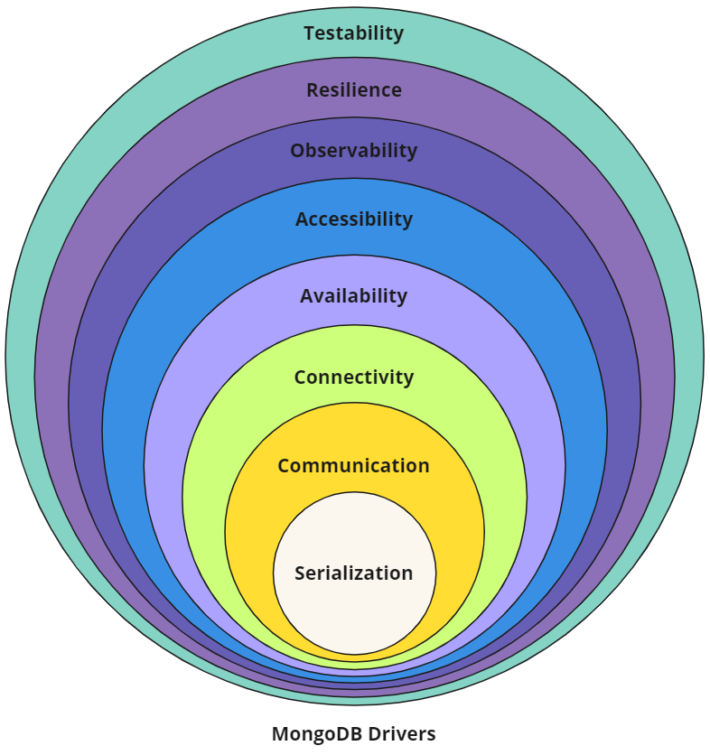

# MongoDB Driver Specifications

The modern MongoDB driver consists of a number of components, each of which are thoroughly documented in [this repository](https://github.com/mongodb/specifications). Though this information is readily available and extremely helpful, what it lacks is a high level overview to tie the specs together into a cohesive picture of what a MongoDB driver is.

Architecturally an implicit hierarchy exists within the drivers, so expressing drivers in terms of an [onion model](https://en.wikipedia.org/wiki/Onion_model) feels appropriate.

## Layers of the Onion



The _"drivers onion"_ is meant to represent how various concepts, components and APIs can be layered atop each other to build a MongoDB driver from the ground up, or to help understand how existing drivers have been structured. Hopefully this representation of MongoDB’s drivers helps provide some clarity, as the complexity of these libraries - like the onion above - could otherwise bring you to tears.

### Serialization

At their lowest level all MongoDB drivers will need to know how to work with [BSON](https://bsonspec.org/). BSON (short for "Binary JSON") is a bin­ary-en­coded serialization of [JSON](https://www.json.org/json-en.html)-like documents, and like JSON, it sup­ports the nesting of arrays and documents. BSON also contains extensions that al­low representation of data types that are not part of the [JSON spec](https://datatracker.ietf.org/doc/html/rfc7159).

> **Specifications:** [BSON](https://bsonspec.org/spec.html), [ObjectId](objectid.md), [Decimal128](bson-decimal128/decimal128.md), [UUID](uuid.md), [DBRef](dbref.md), [Extended JSON](extended-json.md)

### Communication

Once BSON documents can be created and manipulated, the foundation for interacting with a MongoDB host process has been laid. Drivers communicate by sending [database commands](https://www.mongodb.com/docs/manual/reference/command/) as serialized BSON documents using MongoDB’s [wire protocol](https://www.mongodb.com/docs/manual/reference/mongodb-wire-protocol/).

From the provided connection string and options a socket connection is established to a host, which an initial handshake verifies is in fact a valid MongoDB connection by sending a simple [`hello`](https://www.mongodb.com/docs/manual/reference/command/hello/). Based on the response to this first command a driver can continue to establish and authenticate connections.

> **Specifications:** [`OP_MSG`](message/OP_MSG.md), [Command Execution](run-command/run-command.md), [Connection String](connection-string/connection-string-spec.md), [URI Options](uri-options/uri-options.md), [OCSP](ocsp-support/ocsp-support.md), [Initial Handshake](mongodb-handshake/handshake.md), [Wire Compression](compression/OP_COMPRESSED.md), [SOCKS5](socks5-support/socks5.md), [Initial DNS Seedlist Discovery](initial-dns-seedlist-discovery/initial-dns-seedlist-discovery.md)

### Connectivity

Now that a valid host has been found, the cluster’s topology can be discovered and monitoring connections can be established. Connection pools can then be created and populated with connections. The monitoring connections will subsequently be used for ensuring operations are routed to available hosts, or hosts that meet certain criteria (such as a configured [read preference](https://www.mongodb.com/docs/upcoming/core/read-preference/) or acceptable latency window).

> **Specifications:** [SDAM](server-discovery-and-monitoring/server-discovery-and-monitoring.md), [CMAP](connection-monitoring-and-pooling/connection-monitoring-and-pooling.md), [Load Balancer Support](load-balancers/load-balancers.md)

### Authentication

Establishing and monitoring connections to MongoDB ensures they’re available, but MongoDB server processes typically will require the connection to be [authenticated](https://www.mongodb.com/docs/manual/core/authentication/) before commands will be accepted. MongoDB offers many authentication mechanisms such as [SCRAM](https://www.mongodb.com/docs/manual/core/security-scram), [x.509](https://www.mongodb.com/docs/manual/core/security-x.509/), [Kerberos](https://www.mongodb.com/docs/manual/core/kerberos/), [LDAP](https://www.mongodb.com/docs/manual/core/security-ldap/), [OpenID Connect](https://www.mongodb.com/docs/manual/core/security-oidc/) and [AWS IAM](https://www.mongodb.com/docs/atlas/security/passwordless-authentication/), which MongoDB drivers support using the _[Simple Authentication and Security Layer](https://www.ietf.org/rfc/rfc4422.txt)_ (SASL) framework.

> **Specifications:** [Authentication](auth/auth.md)

### Availability

All client operations will be serialized as BSON and sent to MongoDB over a connection that will first be checked out of a connection pool. Various monitoring processes exist to ensure a driver’s internal state machine contains an accurate view of the cluster’s topology so that read and write requests can always be appropriately routed according to MongoDB’s [server selection algorithm](https://www.mongodb.com/docs/manual/core/read-preference-mechanics/).

> **Specifications:** [Server Monitoring](server-discovery-and-monitoring/server-monitoring.md), [`SRV` Polling for mongos Discovery](polling-srv-records-for-mongos-discovery/polling-srv-records-for-mongos-discovery.md), [Server Selection](server-selection/server-selection.md), [Max Staleness](max-staleness/max-staleness.md)

### Resilience

At their core, database drivers are client libraries meant to facilitate interactions between an application and the database. MongoDB’s drivers are no different in that regard, as they abstract away the underlying serialization, communication, connectivity, and availability functions required to programmatically interact with your data.

To further enhance the developer experience while working with MongoDB, various resilience features can be added based on [logical sessions](https://www.mongodb.com/docs/manual/reference/server-sessions/) such as [retryable writes](https://www.mongodb.com/docs/manual/core/retryable-writes), [causal consistency](https://www.mongodb.com/docs/manual/core/read-isolation-consistency-recency/#std-label-causal-consistency), and [transactions](https://www.mongodb.com/docs/manual/core/transactions/).

> **Specifications:** Retryability ([Reads](retryable-reads/retryable-reads.md), [Writes](retryable-writes/retryable-writes.md)), [CSOT](client-side-operations-timeout/client-side-operations-timeout.md), Consistency ([Sessions](sessions/driver-sessions.md), [Causal Consistency](causal-consistency/causal-consistency.md), [Snapshot Reads](sessions/snapshot-sessions.md), [Transactions](transactions/transactions.md), [Convenient Transactions API](transactions-convenient-api/transactions-convenient-api.md))

### Programmability

Now that we can serialize commands and send them over the wire through an authenticated connection we can begin actually manipulating data. Since all database interactions are in the form of commands, if we wanted to remove a single document we might issue a [`delete` command](https://www.mongodb.com/docs/manual/reference/command/delete) such as the following:

```js
db.runCommand(
  {
     delete: "orders",
     deletes: [ { q: { status: "D" }, limit: 0 } ]
  }
)
```

Though not exceedingly complex, a better developer experience can be achieved through more single-purpose APIs. This would allow the above example to be expressed as:

```js
db.orders.deleteMany({ status: "D" })
```

To provide a cleaner and clearer developer experience, many specifications exist to describe how these APIs should be consistently presented across driver implementations, while still providing the flexibility to make APIs more idiomatic for each language.

Advanced security features such as [client-side field level encryption](https://www.mongodb.com/docs/manual/core/csfle/) are also defined at this layer.

> **Specifications:** Resource Management ([Databases](enumerate-databases.md), [Collections](enumerate-collections.md), [Indexes](index-management/index-management.md)), Data Management ([CRUD](crud/crud.md), [Collation](collation/collation.md), [Write Commands](server_write_commands.md), [Bulk API](driver-bulk-update.md), [Bulk Write](crud/bulk-write.md), [R/W Concern](read-write-concern/read-write-concern.md)), Cursors ([Change Streams](change-streams/change-streams.md), [`find`/`getMore`/`killCursors`](find_getmore_killcursors_commands.md)), [GridFS](gridfs/gridfs-spec.md), [Stable API](versioned-api/versioned-api.md), Security ([Client Side Encryption](client-side-encryption/client-side-encryption.md), [BSON Binary Subtype 6](client-side-encryption/subtype6.md))

### Observability

With database commands being serialized and sent to MongoDB servers and responses being received and deserialized, our driver can be considered fully functional for most read and write operations. As MongoDB drivers abstract away most of the complexity involved with creating and maintaining the connections these commands will be sent over, providing mechanisms for introspection into a driver’s functionality can provide developers with added confidence that things are working as expected.

The inner workings of connection pools, connection lifecycle, server monitoring, topology changes, command execution and other driver components are exposed by means of events developers can register listeners to capture. This can be an invaluable troubleshooting tool and can help facilitate monitoring the health of an application.

```js
const { MongoClient, BSON: { EJSON } } = require('mongodb');

function debugPrint(label, event) {
 console.log(`${label}: ${EJSON.stringify(event)}`);
}

async function main() {
 const client = new MongoClient("mongodb://localhost:27017", { monitorCommands: true });
 client.on('commandStarted', (event) => debugPrint('commandStarted', event));
 client.on('connectionCheckedOut', (event) => debugPrint('connectionCheckedOut', event));
 await client.connect();
 const coll = client.db("test").collection("foo");
 const result = await coll.findOne();
 client.close();
}
main();
```

Given the example above (using the [Node.js driver](https://www.mongodb.com/docs/drivers/node/current/)) the specified connection events and command events would be logged as they’re emitted by the driver:

<code>connectionCheckedOut: {"time":{"$date":"2024-05-17T15:18:18.589Z"},"address":"localhost:27018","name":"connectionCheckedOut","connectionId":1}</code><br/>
<code>commandStarted: {"name":"commandStarted","address":"127.0.0.1:27018","connectionId":1,"serviceId":null,"requestId":5,"databaseName":"test","commandName":"find","command":{"find":"foo","filter":{},"limit":1,"singleBatch":true,"batchSize":1,"lsid":{"id":{"$binary":{"base64":"4B1kOPCGRUe/641MKhGT4Q==","subType":"04"}}},"$clusterTime":{"clusterTime":{"$timestamp":{"t":1715959097,"i":1}},"signature":{"hash":{"$binary":"base64":"AAAAAAAAAAAAAAAAAAAAAAAAAAA=","subType":"00"}},"keyId":0}},"$db":"test"},"serverConnectionId":140}</code>

The preferred method of observing internal behavior would be through [standardized logging](logging/logging.md) once it is available in all drivers ([DRIVERS-1204](https://jira.mongodb.org/browse/DRIVERS-1204)), however until that time only event logging is consistently available. In the future additional observability tooling such as [Open Telemetry](https://opentelemetry.io/) support may also be introduced.

> **Specifications:** [Command Logging and Monitoring](command-logging-and-monitoring/command-logging-and-monitoring.md), [SDAM Logging and Monitoring](server-discovery-and-monitoring/server-discovery-and-monitoring-logging-and-monitoring.md), [Standardized Logging](logging/logging.md), [Connection Pool Logging](connection-monitoring-and-pooling/connection-monitoring-and-pooling.md#connection-pool-logging)

### Testability

Ensuring existing as well as net-new drivers can be effectively tested for correctness and performance, most specifications define a standard set of tests using [YAML tests to improve driver conformance](https://web.archive.org/web/20230930061614/https://www.mongodb.com/blog/post/cat-herds-crook-yaml-test-specs-improve-driver-conformance). This allows specification authors and maintainers to describe functionality once with the confidence that the tests can be executed alike by language-specific test runners across all drivers.

Though the unified test format greatly simplifies language-specific implementations, not all tests can be represented in this fashion. In those cases the specifications may describe tests to be manually implemented as prose. By limiting the number of prose tests that each driver must implement, engineers can deliver functionality with greater confidence while also minimizing the burden of upstream verification.

> **Specifications:** [Unified Test Format](unified-test-format/unified-test-format.md), [Atlas Data Federation Testing](https://github.com/mongodb/specifications/tree/master/atlas-data-lake-testing/tests), [Performance Benchmarking](benchmarking/benchmarking.md), [BSON Corpus](bson-corpus/bson-corpus.md), [Replication Event Resilience](https://github.com/mongodb/specifications/tree/master/connections-survive-step-down/tests), [FAAS Automated Testing](faas-automated-testing/faas-automated-testing.md), [Atlas Serverless Testing](serverless-testing/README.md)

## Conclusion

Most (if not all) the information required to build a new driver or maintain existing drivers technically exists within the specifications, however without a mental mode of their composition and architecture it can be extremely challenging to know where to look.

Peeling the _"drivers onion"_ should hopefully make reasoning about them a little easier, especially with the understanding that everything can be tested to validate individual implementations are "up to spec".
